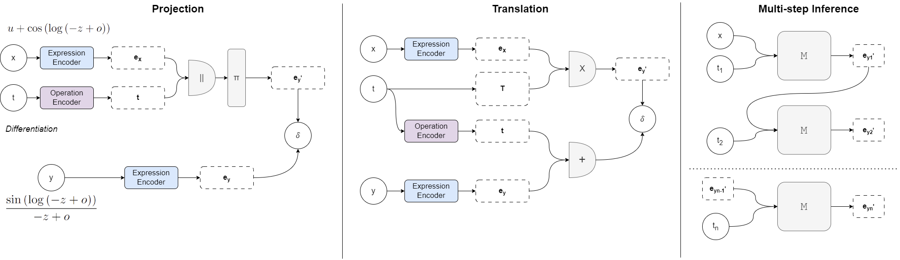

# Multi-Operational Mathematical Derivations in Latent Space

This paper investigates the possibility of approximating multiple mathematical operations in latent space for expression derivation. To this end, we introduce different multi-operational representation paradigms, modelling mathematical operations as explicit geometric transformations. By leveraging a symbolic engine, we construct a large-scale dataset comprising 1.7M derivation steps stemming from 61K premises and 6 operators, analysing the properties of each paradigm when instantiated with state-of-the-art neural encoders.

Specifically, we investigate how different encoding mechanisms can approximate equational reasoning in latent space, exploring the trade-off between learning different operators and specialising within single operations, as well as the ability to support multi-step derivations and out-of-distribution generalisation.
Our empirical analysis reveals that the multi-operational paradigm is crucial for disentangling different operators, while discriminating the conclusions for a single operation is achievable in the original expression encoder. Moreover, we show that architectural choices can heavily affect the training dynamics, structural organisation, and generalisation of the latent space, resulting in significant variations across paradigms and classes of encoders.

#

# Reproducibility

Welcome! :) 

In this repository, you can find the code (`latent_reasoning.py` and `latent_reasoning_multistep.py`) to reproduce the results obtained in our paper with different neural encoders and multi-operational paradigms.

Keep in mind this is experimental code subject to continuous optimisation and changes. If you have any questions, please send an email to `marco.valentino@idiap.ch`.

## Synthetic Data

The complete dataset generated using our methodology (`premises_dataset.json`) is available here: https://drive.google.com/file/d/1YnTyE9KVSGonTSa2LzU3q0E4ntK8q-8u/view?usp=sharing

The multi-step derivation data (`multiple_steps.json`) is available here: https://drive.google.com/file/d/1chHdyLVCwNxCvuEQ9n13yRVUWDspGp2g/view?usp=sharing

To start the experiments, download the datasets and store them in `./data`.
